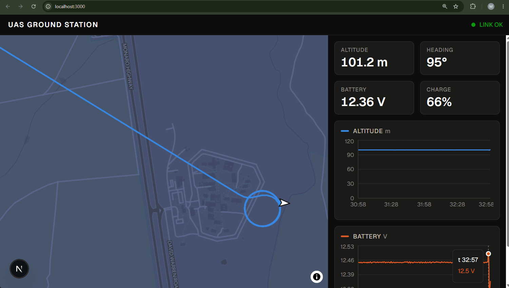
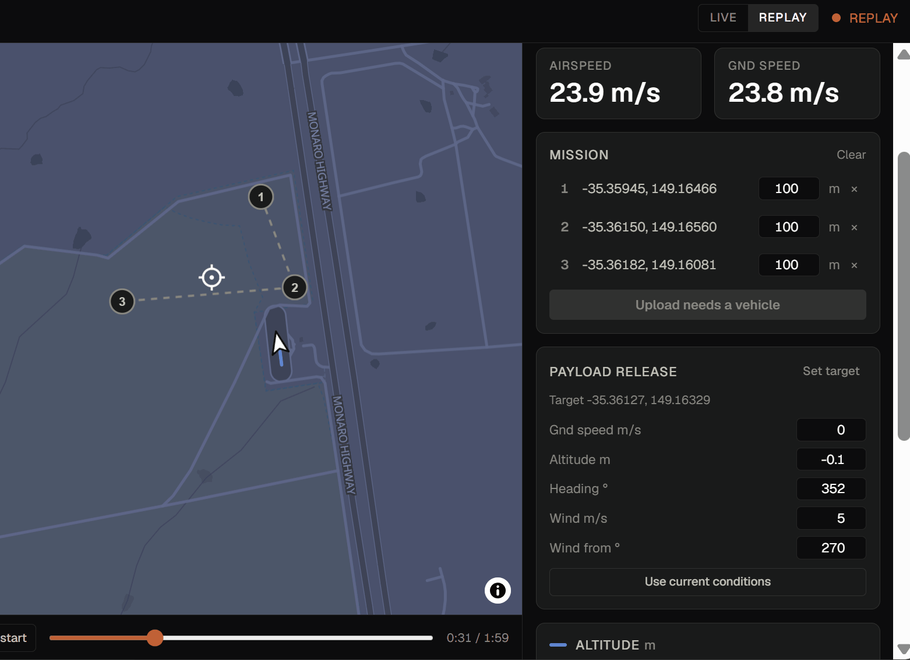
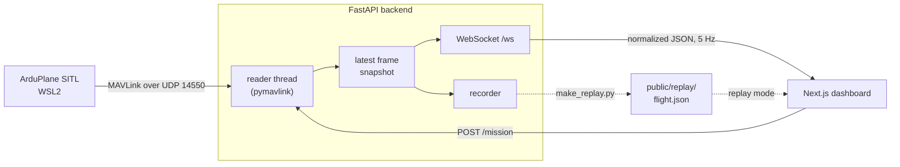
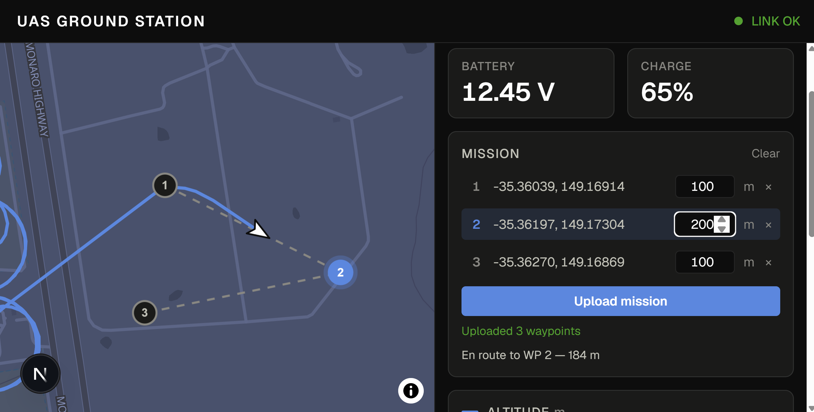
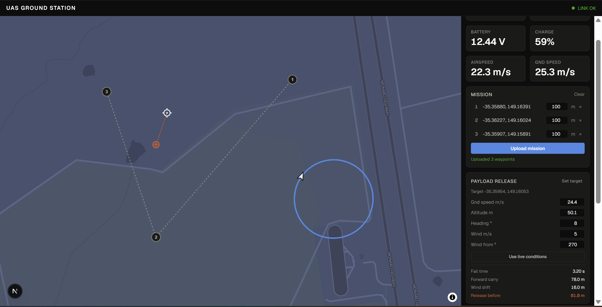

# UAS Ground Station

Ground control station for a fixed-wing UAS. Live MAVLink telemetry from ArduPilot SITL, a vector map with the flight track, waypoint upload and mission monitoring, a payload release solver, and offline replay of recorded flights.

**[Live demo →](https://uas-ground-station.vercel.app)**: plays a recorded flight in the browser. No install, no vehicle, no backend.



## Two modes

**Live**: the backend listens for MAVLink over UDP, translates it into a normalized telemetry format, and streams it to the browser over a WebSocket.

**Replay**: the frontend plays a recorded flight from a static JSON file. **No backend, no vehicle, no network beyond the page itself.** This constraint drove the architecture: the frontend never sees raw MAVLink, only the normalized format, so both modes produce identically shaped data and share one code path into the UI.



Everything except mission upload keeps working with the backend off: the map, charts, waypoint planning, and the release solver are all either replayed or computed in the browser. Upload is the one action that genuinely needs a vehicle, and it says so.

A deployed copy of this app therefore runs the replay flight, the map, planning and the solver, but not live telemetry: the backend listens on `127.0.0.1`, so live mode only means anything when the page is served from the same machine. The app picks its starting mode from the hostname for that reason.

## Architecture



Blocking pymavlink calls cannot run on the event loop, so a daemon thread owns the MAVLink connection and swaps each normalized frame into a shared reference (a whole-reference swap is atomic under the GIL). The WebSocket handler and the recorder are independent consumers of that snapshot, both sampling at 5 Hz, which is why a recording is exactly what the browser saw.

Mission upload is an autopilot-driven handshake arriving on the same UDP link as telemetry, so it has to run on the thread that owns the connection: the HTTP handler puts a job on a queue and waits, and the reader loop services it between messages.

## Stack

| Part | Technology |
| --- | --- |
| Frontend | Next.js (App Router), TypeScript, Tailwind |
| Map | MapLibre GL via `react-map-gl`, OpenFreeMap `fiord` style (no API key) |
| Charts | Recharts |
| Backend | Python 3.12, FastAPI, pymavlink |
| Vehicle | ArduPilot SITL (ArduPlane) in WSL2 |

## Normalized telemetry format

Flat JSON, SI units, unit suffix in every field name. Conversions happen once, at the MAVLink boundary in `backend/telemetry.py`. The format only ever grows by adding optional fields, never by renaming or re-scaling one, so recorded logs stay playable.

| Field | Unit | MAVLink source |
| --- | --- | --- |
| `schema` | n/a | format version (currently 1) |
| `time_s` | s | `GLOBAL_POSITION_INT.time_boot_ms` |
| `alt_m` | m above home | `GLOBAL_POSITION_INT.relative_alt` |
| `lat_deg`, `lon_deg` | ° | `GLOBAL_POSITION_INT.lat`, `.lon` |
| `hdg_deg` | ° | `GLOBAL_POSITION_INT.hdg` |
| `battery_v` | V | `SYS_STATUS.voltage_battery` |
| `battery_pct` | % | `SYS_STATUS.battery_remaining` |
| `wp_seq` | n/a | `MISSION_CURRENT.seq` |
| `wp_dist_m` | m | `NAV_CONTROLLER_OUTPUT.wp_dist` |
| `airspeed_mps`, `groundspeed_mps` | m/s | `VFR_HUD.airspeed`, `.groundspeed` |

Only `schema`, `time_s` and `alt_m` are guaranteed on every frame; the rest appear as their source messages arrive.

## Running it

### Replay only (no vehicle needed)

```bash
cd frontend
npm install
npm run dev
```

Open http://localhost:3000 and switch the header toggle to **REPLAY**.

### Live

Three processes. **SITL**, in WSL2:

```bash
sim_vehicle.py -v ArduPlane --out udp:127.0.0.1:14550
```

The explicit `--out` is required: under WSL2 mirrored networking, `sim_vehicle.py`'s host-IP auto-detection resolves to the LAN gateway and telemetry never reaches Windows.

**Backend**:

```bash
cd backend
python -m venv .venv && .venv/Scripts/activate
pip install -r requirements.txt
uvicorn app:app
```

**Frontend**: `npm run dev` in `frontend/`, then http://localhost:3000.

To fly a mission: click waypoints on the map, press **Upload mission**, then `mode auto` in the MAVProxy console.



### Deploying

The frontend deploys as a normal Next.js app with **Root Directory set to `frontend`** and no environment variables. What ships is the replay experience described above.

The backend is not deployable to a serverless host: it needs a long-lived process holding a UDP socket to receive MAVLink, which is the opposite of a request-scoped function. Run it locally alongside SITL.

## Recording a replay log

The backend records automatically, writing every frame to `backend/recordings/<timestamp>-<pid>.jsonl`: line-delimited, so a backend killed mid-flight still leaves a valid file. To turn a recording into the replay asset:

```bash
python make_replay.py recordings/20260820-105758.jsonl --start 425 --duration 120
```

That writes `frontend/public/replay/flight.json`. `time_s` is the vehicle's boot clock and restarts when the vehicle does, so one recording can contain several flights; the script splits on the reset and uses the longest by default (`--segment N` to pick another).

## Payload release solver

Given a target clicked on the map plus groundspeed, altitude, approach heading and wind, the solver computes where the payload must be released to land on the target.



```
fall time     t = √(2h / g)
forward carry     groundspeed × t, along the approach heading
wind drift        wind speed × t, toward (wind_from + 180°)
release point     target − (carry vector + drift vector)
```

Groundspeed rather than airspeed, because what the payload inherits at release is motion over the ground.

**Model limitations:** this is a first-order solution. It ignores drag on the forward carry and assumes the payload couples to the wind instantly. Real drop tables add a ballistic coefficient and integrate the trajectory.

## Repository layout

```
backend/
  app.py           FastAPI app: reader thread, WebSocket, POST /mission, recorder
  telemetry.py     MAVLink -> normalized format
  mission.py       MAVLink mission upload handshake
  make_replay.py   recorded JSONL -> replay asset
frontend/app/
  page.tsx         dashboard, live/replay modes
  components/      FlightMap, TelemetryChart
  lib/             release solver, replay loader, telemetry types
docs/media/        captures
NOTES.md           problems hit and how they were solved
```

## License

MIT. See [LICENSE](LICENSE).
